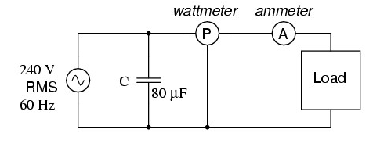

<h2>Power Factor and Its Importance</h2>

    Power factor is a crucial parameter in electrical engineering that determines the efficiency of power usage in an AC circuit. It defines the phase relationship between voltage and current waveforms and is used to calculate both active and reactive power in an electrical circuit. 

    <strong>Power Factor (PF) = cosɸ</strong>, where ɸ (phi) is the phase  difference between voltage and current.

    A lower power factor means more power is wasted as reactive power, which increases the current load in the system. In DC circuits, power factor is always unity (1), whereas in AC circuits, it varies between 0 and 1 based on the type of load (resistive, inductive, or capacitive).

<em>Figure 1: Experimental setup for measuring power and power factor in a single-phase AC circuit using a wattmeter, ammeter, and capacitive load.</em>

<h2>Types of Power in AC Circuits</h2>

    AC circuits have three types of power:

<ul>
    <li><strong>Active Power (P):</strong> The actual power consumed by resistive components, measured in watts (W).</li>
    <li><strong>Reactive Power (Q):</strong> Power oscillating between the source and reactive components like inductors and capacitors, measured in Volt-Amperes Reactive (VAR).</li>
    <li><strong>Apparent Power (S):</strong> The total power supplied, including both active and reactive power, measured in Volt-Amperes (VA).</li>
</ul>

    <strong>Relationship:</strong> S = Vrms × Irms

<h2>Power Factor Formula and Power Calculations</h2>

 
    The power factor represents how efficiently power is used and is given by:

    <strong>Power Factor = P / S = cos(ɸ)</strong>

    A power factor of 1 (unity) means no reactive power is wasted, while a lower power factor indicates inefficiency.

<h3>Actual Power Calculation:</h3>

    <strong>Actual Power = W × M.F.</strong>

<h3>Calculated Power:</h3>

    <strong>P = V × I × cosɸ</strong>

    Ideally, actual power should match the calculated power. Differences may indicate measurement errors or harmonic distortions.

<h3>Wattmeter and Multiplying Factor</h3>

    Since wattmeters have a limited scale, a multiplying factor adjusts readings to the correct power values.

<ul>
    <li><strong>Multiplying Factor (M.F) = Voltage Range × Current Range × Rated Power Factor × Half Scale Deflection</strong></li>
    <li>The half-scale deflection value is obtained from the wattmeter.</li>
</ul>

    A wattmeter typically has a full-scale deflection, but readings are often taken at half-scale deflection to improve accuracy. The deflection of the wattmeter needle represents power consumption. Half-scale deflection allows for better calibration and minimizes errors.

    The multiplication factor ensures the correct power consumption is determined from the observed deflection value.

<h2>Inductive Circuits and Power Factor</h2>

    In an inductive AC circuit, the current lags behind the voltage due to inductive reactance (XL), increasing the phase angle (θ) and reducing the power factor.

    <strong>Inductive Reactance:</strong> XL = 2πfL

    Higher inductance leads to a greater phase shift and a lower power factor.

<h2>Power Factor Correction</h2>

    Power factor can be improved by adding a capacitor in parallel with the load, reducing the phase difference between voltage and current.

    <strong>Capacitive Reactance:</strong> XC = 1 / (2πfC)

    When XC = XL, the circuit reaches resonance, improving the power factor to unity.

<h2>VI Characteristics and Power Factor</h2>

    The voltage-current (VI) characteristics describe how the current in a circuit responds to changes in voltage and how this relationship affects the power factor.

    In circuits with a high power factor (close to unity), the current waveform closely follows the voltage waveform, meaning that most of the supplied power is effectively utilized.

    In circuits with a low power factor, the current lags or leads the voltage significantly due to inductive or capacitive effects, leading to higher losses in power transmission and increased stress on electrical components.

    A lower power factor results in:

<ul>
    <li>Increased current for the same real power, leading to higher I²R losses.</li>
    <li>Voltage drops across transmission lines, reducing efficiency.</li>
    <li>Overloading of transformers and generators due to higher reactive power demand.</li>
</ul>

    Improving the power factor using capacitors or synchronous condensers can help mitigate these issues and enhance overall system performance.

